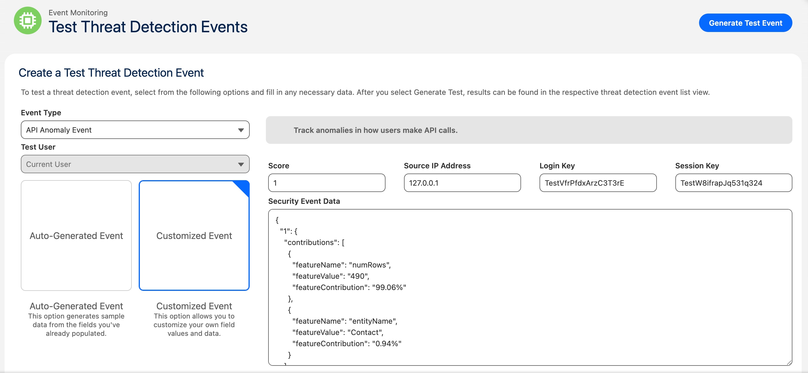

# Salesforce Transaction Security Policy Cookbook

A collection of practical Salesforce Transaction Security Policy recipes. Examples to help admins and developers monitor events, block high-risk actions, and enforce security compliance.

## Purpose

Transaction Security Policies (TSP) are powerful Salesforce security tools that help you monitor and control user activities in real-time. This repository provides ready-to-use examples that demonstrate how to leverage TSPs to protect your organization from security risks and enforce compliance policies.

### What Are Transaction Security Policies?

Transaction Security Policies evaluate events in real-time and take immediate action when suspicious or unauthorized activities are detected. They can:

- **Monitor** critical events like API calls, exports, logins, and data access
- **Block** unauthorized or risky actions before they complete
- **Alert** administrators via email and in-app notifications
- **Enforce** organizational security standards automatically

### Security Use Cases & Examples

Here are practical examples of how Transaction Security Policies can strengthen your org's security:

#### 1. **Prevent Mass Data Exports**

- Block users from exporting large datasets via browser extensions (like Salesforce Inspector Reloaded)
- Prevent Data Loader exports exceeding certain row limits
- Monitor and restrict Big Object queries that return unbounded results

#### 2. **Control API Access**

- Restrict API access from unauthorized IP addresses or countries
- Block API calls made outside business hours
- Monitor excessive API usage patterns that may indicate data scraping

#### 3. **Protect Sensitive Data**

- Prevent access to PII fields from untrusted locations
- Block bulk exports of customer or financial data
- Monitor access to confidential records

#### 4. **Enforce Permission Boundaries**

- Prevent assignment of sensitive permissions to unauthorized users
- Block changes to critical permission sets or profiles
- Monitor privilege escalation attempts

#### 5. **Detect Suspicious Login Patterns**

- Block logins from high-risk countries or IP ranges
- Detect credential stuffing or brute force attempts
- Alert on concurrent sessions from different locations

#### 6. **Audit Compliance**

- Track all admin configuration changes
- Monitor access to regulated data (HIPAA, GDPR, etc.)
- Generate compliance reports for security audits

## ⚠️ Important Notice

**Test in Sandbox First!** Some Transaction Security Policies in this repository include blocking actions that will prevent users from completing certain operations. Before deploying to production:

1. **Deploy to a sandbox environment first**
2. **Test thoroughly** to ensure policies behave as expected
3. **Verify notification recipients** are configured correctly
4. **Review policy conditions** to match your organization's requirements
5. **Train your team** on what actions may be blocked and why

Blocking policies can disrupt user workflows if not properly configured. Always validate in a non-production environment before enabling in production.

## Deployment

### Prerequisites

Before deploying Transaction Security Policies, ensure you have:

- **Salesforce CLI** (`sf`) installed and configured
- **jq** installed for JSON parsing (`brew install jq` on macOS)
- Authenticated to your target Salesforce org (`sf org login web --set-default`)

### How to Deploy

Use the provided deployment script to automatically deploy Transaction Security Policies to your org:

```bash
# Deploy to default org (using org's username for notifications)
./deployTransactionSecurityPolicies.sh

# Deploy with custom notification recipient
./deployTransactionSecurityPolicies.sh admin@yourcompany.com
```

### Why Use the Deployment Script?

The `deployTransactionSecurityPolicies.sh` script automates several critical steps that would otherwise be manual and error-prone:

#### 1. Dynamic Email Configuration

- Automatically retrieves your org's username for notifications
- Replaces placeholder emails in policy files with actual recipients
- Supports custom notification recipients via command-line argument

The script saves time, reduces errors, and ensures consistent deployments across environments.

## Testing Transaction Security Policies

### Generate Test Events for Threat Detection (Beta)

Salesforce provides a beta feature that allows you to generate test events for threat detection without triggering real security incidents. This is particularly useful for validating that your Transaction Security Policies are configured correctly and will respond as expected to real threats.



**How to Use:**

1. Navigate to **Setup → Event Manager → Threat Detection Events**
2. Click the **"Generate Test Event"** button
3. Select an **Event Type** (e.g., API Anomaly Event, Credential Stuffing, Login Anomaly)
4. Choose between **Auto-Generated Event** (uses sample data) or **Customized Event** (define your own values)
5. Fill in required fields like Score, Source IP Address, Login Key, and Session Key
6. For customized events, provide Security Event Data in JSON format
7. Click **"Generate Test"** to create the test event
8. Monitor your Transaction Security Policies to verify they trigger appropriately
9. Check notifications and policy actions to ensure they work as configured

**Benefits:**

- Test policies safely without impacting real users or data
- Validate policy conditions and flow logic before enabling in production
- Train security teams on how policies respond to threats
- Troubleshoot policy configurations without waiting for real events

**Learn More:** [Generate Test Events for Threat Detection (Beta)](https://help.salesforce.com/s/articleView?id=release-notes.rn_security_em_test_threat_detection_events.htm&release=252&type=5)

**Note:** This is a beta feature and may not be available in all Salesforce editions or orgs. Check with Salesforce documentation for current availability and requirements.

## Examples

This repository includes Transaction Security Policies covering various security scenarios:

| Policy | Type | Event Monitored | Description |
|--------|------|-----------------|-------------|
| **Alert Critical Permission Assignment** | Alert | `PermissionSetEventStore` | Monitors critical permission assignments and alerts when assigned by non-CI/CD users |
| **Block Salesforce Inspector Export** | Block | `ApiEvent` | Prevents mass data exports exceeding 2,000 rows via browser extensions |
| **Block Transaction Security Exemption** | Block | `PermissionSetEventStore` | Prevents creation/assignment of TransactionSecurityExempt permission |
| **Alert API Anomaly** | Alert | `ApiAnomalyEventStore` | Detects unusual API usage patterns and potential data scraping |
| **Alert Credential Stuffing** | Alert | `CredentialStuffingEventStore` | Identifies credential stuffing attacks using stolen credentials |
| **Alert Login Anomaly** | Alert | `LoginAnomalyEventStore` | Monitors login patterns for suspicious behavior |
| **Alert Session Hijacking** | Alert | `SessionHijackingEventStore` | Detects session hijacking via browser fingerprint analysis |
| **Alert Guest User Anomaly** | Alert | `GuestUserAnomalyEventStore` | Tracks data access anomalies from guest user permission misconfigurations |
| **Alert Report Anomaly** | Alert | `ReportAnomalyEventStore` | Monitors report access patterns for unusual data extraction |

**Note:** All policies in this cookbook use Flow-based condition logic (Custom Condition Builder). Apex-based Transaction Security Policies are not included in the current version but may be added in a future iteration for more complex evaluation scenarios.

---

## Alert Critical Permission Assignment

**Transaction Security Policy:** `AlertCriticalPermissionAs`

### Overview

This Transaction Security Policy monitors when critical permissions are assigned to users and sends alerts when the assignment is made by someone other than your designated CI/CD service account. This helps detect unauthorized privilege escalations and ensures permission changes go through approved automation pipelines.

### How It Works

The policy monitors `PermissionSetEventStore` events and evaluates the following conditions:

1. **Operation Check**: Verifies the operation is "AssignedToUsers" (permission assignment)
2. **Username Check**: Triggers when the username is NOT your CI/CD service account

**Condition Logic:** `Operation = "AssignedToUsers" AND Username != "cicd-username@company.com"`

### Monitored Permissions

This policy monitors the following critical permissions:

**User Management:**

- `ManageUsers` - Create, edit, and deactivate users
- `ManageInternalUsers` - Manage internal Salesforce users
- `FreezeUsers` - Freeze and unfreeze user accounts
- `ResetPasswords` - Reset user passwords
- `MonitorLoginHistory` - View login history

**Security & Authentication:**

- `ForceTwoFactor` - Require two-factor authentication
- `ManagePasswordPolicies` - Configure password policies
- `PasswordNeverExpires` - Exempt users from password expiration
- `ManageEncryptionKeys` - Manage platform encryption keys

**Permissions & Access:**

- `AssignPermissionSets` - Assign permission sets to users
- `ManageProfilesPermissionsets` - Create and modify profiles and permission sets
- `ManageRoles` - Manage role hierarchy
- `ManageSharing` - Manage sharing settings

**System & Configuration:**

- `CustomizeApplication` - Modify org configuration
- `AuthorApex` - Author and deploy Apex code
- `ModifyAllData` - Modify all organization data
- `ViewAllData` - View all organization data

**Data Cloud Permissions:**

- `ManageDataspaceScope` - Manage Data Cloud dataspace scope
- `ManageAccessPolicies` - Manage Data Cloud access policies
- `ModifyAllDataGovPolicies` - Modify all data governance policies
- `ModifyAccessAllowPolicies` - Modify access allow policies
- `ModifyAccessDenyPolicies` - Modify access deny policies
- `ModifyAllDataGovTagAssign` - Modify data governance tag assignments

### Actions When Triggered

- 📧 **Email Alert**: Sends email notification to specified users

**Note:** This is an alerting-only policy. It notifies administrators of potentially unauthorized permission changes but does not block them. This approach prevents disrupting legitimate operations while maintaining audit visibility.

### Customization Options

#### Update Your CI/CD Username

The most important customization is setting your CI/CD service account username. Edit the flow condition in the `PolicyCondition_AlertCriticalPermissionAs` flow to match your automation user. Look for the `Username` condition and replace `cicd-username@company.com` with your actual CI/CD service account.

**File to edit:** `force-app/main/default/flows/PolicyCondition_AlertCriticalPermissionAs.flow-meta.xml`

#### Restrict to Specific Permissions

By default, this policy monitors all critical permissions listed above. To target only specific permissions, you can add a filter condition to check the `PermissionType` field in the flow. You can filter for a single permission (e.g., `ModifyAllData`) or multiple permissions using the `In` operator. Add these conditions within the flow's decision element using `AND` logic with the existing conditions.

#### Convert to Blocking Policy

If you want to block unauthorized permission assignments instead of just alerting, change the `<block>` action setting from `false` to `true` in the Transaction Security Policy file. You may also want to enable in-app notifications when blocking actions.

### Use Cases

This policy is particularly useful for:

- **Enforcing GitOps workflows** - Ensure all permission changes go through CI/CD
- **Detecting privilege escalation** - Alert on manual permission assignments by administrators
- **Compliance auditing** - Track who assigns sensitive permissions
- **Security monitoring** - Identify suspicious permission changes
- **Change management** - Enforce approval processes for permission modifications

### Files

- **Transaction Security Policy**: `force-app/main/default/transactionSecurityPolicies/AlertCriticalPermissionAs.transactionSecurityPolicy-meta.xml`

## Block Salesforce Inspector Reloaded Export

**Transaction Security Policy:** `BlockSalesforceInspectorR`

### Overview

This Transaction Security Policy prevents users from exporting more than 2,000 rows using Salesforce Inspector Reloaded (or any browser extension). When triggered, it blocks the action and sends notifications to administrators.

### How It Works

The policy monitors `ApiEvent` records and evaluates the following conditions:

1. **Client Detection**: Checks if the API client is "Salesforce Inspector Reloaded"
2. **Row Count Check**: Triggers when:
   - `RowsProcessed` is greater than 2,000 rows, OR
   - `RowsProcessed` equals `-1` (indicates big objects where total rows exceed the API batch size)

**Condition Logic:** `Client = "Salesforce Inspector Reloaded" AND (RowsProcessed > 2000 OR RowsProcessed = -1)`

### Actions When Triggered

- ✋ **Block**: Prevents the export operation
- 📧 **Notifications**: Sends in-app and email alerts to specified users

### Customization Options

#### Change the Target Client/Extension

You can modify this policy to monitor other browser extensions or API clients by updating the `Client` condition in the flow. Common client names include "Salesforce Inspector Reloaded", "Data Loader", or custom API integrations.

**File to edit:** `force-app/main/default/flows/PolicyCondition_BlockSalesforceInspectorR.flow-meta.xml`

#### Adjust the Row Count Threshold

To change the maximum allowed rows (default: 2,000), update the `RowsProcessed` condition in the flow. Edit the `GreaterThan` condition to use your desired threshold value.

### About RowsProcessed = -1

The special value of `-1` for `RowsProcessed` occurs when querying big objects. When the total number of returned rows exceeds the API batch size, Salesforce sets `RowsProcessed` to `-1` to indicate that the full result set size is unknown or unbounded. Including this condition ensures that potentially large exports from big objects are also monitored and blocked.

### Files

- **Transaction Security Policy**: `force-app/main/default/transactionSecurityPolicies/BlockSalesforceInspectorR.transactionSecurityPolicy-meta.xml`

## Block Transaction Security Exemption

**Transaction Security Policy:** `BlockTransactionSecurityE`

### Overview

This Transaction Security Policy prevents users from creating or assigning Permission Sets that grant the `TransactionSecurityExempt` permission. This permission allows users to bypass all Transaction Security Policies, which could create serious security vulnerabilities. By blocking its assignment, you ensure that all security policies remain effective.

### How It Works

The policy monitors `PermissionSetEventStore` events and blocks operations that involve the `TransactionSecurityExempt` permission.

**Event Monitored:** `PermissionSetEventStore`

### Actions When Triggered

- ✋ **Block**: Prevents the permission set creation or assignment
- 📧 **Email Alert**: Sends email notification to specified users

**Important:** This permission can also be assigned through Profiles. Consider implementing additional controls at the profile level to ensure comprehensive protection.

### Use Cases

This policy is critical for:

- **Maintaining security policy integrity** - Ensure no users can bypass security controls
- **Compliance enforcement** - Prevent unauthorized exemptions from audit policies
- **Insider threat prevention** - Block attempts to grant unrestricted access
- **Security governance** - Maintain consistent security posture across all users

### Files

- **Transaction Security Policy**: `force-app/main/default/transactionSecurityPolicies/BlockTransactionSecurityE.transactionSecurityPolicy-meta.xml`

## Alert API Anomaly

**Transaction Security Policy:** `AlertApiAnomaly`

### Overview

This Transaction Security Policy monitors API usage patterns and alerts administrators when anomalous API behavior is detected. Salesforce's machine learning models identify unusual API call patterns that may indicate data scraping, unauthorized access, or compromised credentials.

### How It Works

The policy monitors `ApiAnomalyEventStore` events generated by Salesforce's anomaly detection engine.

**Event Monitored:** `ApiAnomalyEventStore`

### Actions When Triggered

- 📧 **Alerts**: Sends in-app and email notifications to specified users

### What API Anomalies Can Detect

- Unusual volume of API calls from a user account
- API access from unexpected locations or IP addresses
- Abnormal data retrieval patterns
- API usage outside normal working hours
- Sudden changes in API call frequency or patterns

### Use Cases

This policy helps protect against:

- **Data exfiltration** - Detect bulk data exports via API
- **Compromised credentials** - Identify unauthorized API access
- **Automated attacks** - Spot bot-driven data scraping
- **Insider threats** - Monitor suspicious API usage by internal users

### Files

- **Transaction Security Policy**: `force-app/main/default/transactionSecurityPolicies/AlertApiAnomaly.transactionSecurityPolicy-meta.xml`

## Alert Credential Stuffing

**Transaction Security Policy:** `AlertCredentialStuffing`

### Overview

This Transaction Security Policy detects credential stuffing attacks where malicious actors use stolen username/password combinations from other breaches to attempt unauthorized access to your Salesforce org. Salesforce's threat detection identifies these patterns and triggers alerts.

### How It Works

The policy monitors `CredentialStuffingEventStore` events that Salesforce's security systems generate when credential stuffing patterns are detected.

**Event Monitored:** `CredentialStuffingEventStore`

### Actions When Triggered

- 📧 **Alerts**: Sends in-app and email notifications to specified users

### What Credential Stuffing Detection Identifies

- Multiple failed login attempts using stolen credentials
- Login attempts from known malicious IP addresses
- Patterns consistent with automated credential testing
- Use of credentials compromised in external data breaches

### Use Cases

This policy protects against:

- **Account takeover** - Prevent unauthorized access using stolen credentials
- **Brute force attacks** - Detect automated login attempts
- **Credential reuse attacks** - Identify use of breached passwords
- **Security incident response** - Alert security teams to active threats

### Files

- **Transaction Security Policy**: `force-app/main/default/transactionSecurityPolicies/AlertCredentialStuffing.transactionSecurityPolicy-meta.xml`

## Alert Login Anomaly

**Transaction Security Policy:** `AlertLoginAnomaly`

### Overview

This Transaction Security Policy monitors login patterns and alerts when anomalous login behavior is detected. Salesforce's machine learning analyzes login characteristics and identifies suspicious activities that deviate from normal user behavior.

### How It Works

The policy monitors `LoginAnomalyEventStore` events generated by Salesforce's anomaly detection engine.

**Event Monitored:** `LoginAnomalyEventStore`

### Actions When Triggered

- 📧 **Alerts**: Sends in-app and email notifications to specified users

### What Login Anomalies Can Detect

- Logins from unusual geographic locations
- Access from new or suspicious devices
- Login times that differ from normal patterns
- Impossible travel scenarios (e.g., logins from distant locations within short timeframes)
- Changes in login behavior or device characteristics

### Use Cases

This policy helps detect:

- **Compromised accounts** - Identify unauthorized access attempts
- **Insider threats** - Monitor suspicious login patterns
- **Shared credentials** - Detect multiple users sharing login credentials
- **Unusual access patterns** - Alert on deviations from normal behavior

### Files

- **Transaction Security Policy**: `force-app/main/default/transactionSecurityPolicies/AlertLoginAnomaly.transactionSecurityPolicy-meta.xml`

## Alert Session Hijacking

**Transaction Security Policy:** `AlertSessionHijacking`

### Overview

This Transaction Security Policy detects session hijacking attempts where unauthorized users gain control of a legitimate user's session using a stolen session identifier. Salesforce analyzes browser fingerprints and detects significant deviations that indicate potential session hijacking.

### How It Works

The policy monitors `SessionHijackingEventStore` events. Salesforce evaluates how significantly a user's current browser fingerprint diverges from their previously known fingerprint using probabilistic inference to determine the significance of change.

**Event Monitored:** `SessionHijackingEventStore`

### Actions When Triggered

- 📧 **Alerts**: Sends in-app and email notifications to specified users

### What Session Hijacking Detection Identifies

- Sudden changes in browser characteristics mid-session
- Session access from different devices or locations
- Modifications to user agent or browser fingerprint
- Suspicious session token usage patterns

### Use Cases

This policy protects against:

- **Session theft** - Detect stolen session identifiers being used
- **Man-in-the-middle attacks** - Identify intercepted sessions
- **Cookie theft** - Alert on unauthorized session cookie usage
- **Cross-site scripting (XSS) attacks** - Detect session token compromise

### Files

- **Transaction Security Policy**: `force-app/main/default/transactionSecurityPolicies/AlertSessionHijacking.transactionSecurityPolicy-meta.xml`

## Alert Guest User Anomaly

**Transaction Security Policy:** `AlertGuestUserAnomaly`

### Overview

This Transaction Security Policy tracks data access anomalies caused by guest user permission misconfigurations. Guest users (unauthenticated users accessing Experience Cloud sites) should have restricted access, and this policy alerts when anomalous data access patterns indicate potential permission issues.

### How It Works

The policy monitors `GuestUserAnomalyEventStore` events that detect unusual data access by guest users.

**Event Monitored:** `GuestUserAnomalyEventStore`

### Actions When Triggered

- 📧 **Alerts**: Sends in-app and email notifications to specified users

### What Guest User Anomalies Can Detect

- Guest users accessing sensitive or restricted data
- Abnormal volume of data queries by guest users
- Access to objects or records that should be restricted
- Permission misconfigurations in Experience Cloud sites
- Potential security vulnerabilities in sharing settings

### Use Cases

This policy is important for:

- **Experience Cloud security** - Ensure guest users have appropriate access
- **Permission auditing** - Identify misconfigured guest user permissions
- **Data exposure prevention** - Detect unintended data access
- **Compliance** - Monitor guest user access to regulated data

### Files

- **Transaction Security Policy**: `force-app/main/default/transactionSecurityPolicies/AlertGuestUserAnomaly.transactionSecurityPolicy-meta.xml`

## Alert Report Anomaly

**Transaction Security Policy:** `AlertReportAnomaly`

### Overview

This Transaction Security Policy monitors report access and generation patterns to detect anomalous behavior. Unusual report usage can indicate data exfiltration attempts, compromised accounts, or unauthorized data access.

### How It Works

The policy monitors `ReportAnomalyEventStore` events that detect unusual report access patterns.

**Event Monitored:** `ReportAnomalyEventStore`

### Actions When Triggered

- 📧 **Alerts**: Sends in-app and email notifications to specified users

### What Report Anomalies Can Detect

- Unusual volume of report exports
- Access to sensitive reports by unauthorized users
- Reports run outside normal business hours
- Abnormal patterns in report generation
- Mass data extraction through reports

### Use Cases

This policy helps prevent:

- **Data exfiltration** - Detect bulk data exports via reports
- **Unauthorized data access** - Monitor sensitive report usage
- **Compliance violations** - Track access to regulated data in reports
- **Insider threats** - Identify suspicious report generation patterns

### Files

- **Transaction Security Policy**: `force-app/main/default/transactionSecurityPolicies/AlertReportAnomaly.transactionSecurityPolicy-meta.xml`
